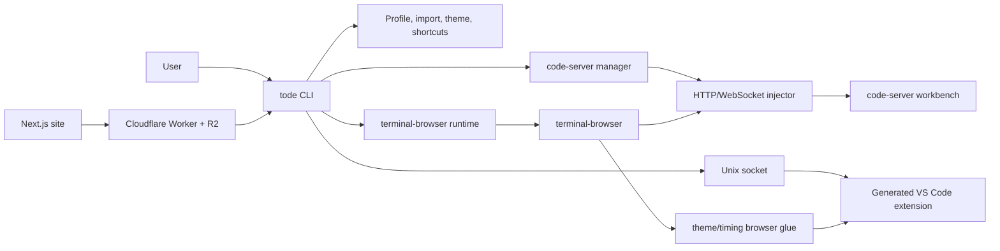

# System Context

# Main Components

| Surface | Current responsibility | Primary evidence |
|---|---|---|
| `src/main.ts` | Manual CLI parsing, command dispatch, launch ordering, window reuse, timing, extensions | `openCommand`, `main` |
| `src/codeserver/**` | Pinned code-server install, state file, free ports, readiness, injector, warm-up, shutdown | `ensureServer`, `startServer`, `startInjector` |
| `src/runtime/**` | XDG/install paths, vendored terminal-browser resolution, verified download/unpack | `resolveRuntime`, `fetchVerified` |
| `src/bridge*`, `src/ipc.ts` | Generated VS Code extension, newline-delimited JSON socket control, startup marker | `bridgeSource`, `sendToExtension` |
| `src/browser*`, `src/livesync.ts` | Browser preload/main glue, live terminal colors, workbench timing fan-out | browser glue tests |
| `src/profile.ts`, `src/import/**`, `src/theme/**` | Fonts, settings, JSONC edits, keybindings, themes, editor import | profile/import/theme tests |
| `src/shortcuts/**` | Ghostty/Kitty detection, config edits, conflict state machine, persistence, reload | shortcut and closed-loop tests |
| `src/pages/**`, `src/webui/**` | Embedded shortcut/import browser pages and local token handling | Vite pages |
| `release-worker/**` | Stable/dev manifests, installers, R2 downloads, range/HEAD behavior | worker `fetch` handler |
| `web/**` | Public site and `/install` proxy to the release worker | Next.js config |
| `scripts/**`, workflow | Build, dist, installer, publishing, keymap generation, versioning | shell scripts and release workflow |

# Observed Coupling

The indexed call graph contains 1,201 nodes and 3,209 edges. Strong boundaries include shortcuts to profile, bridge to live sync, import to profile/live sync, and shortcuts to browser glue/injection. Several files combine policy, process I/O, persistence, and presentation:

* `src/main.ts`: 497 lines.
* `src/shortcuts/wizard.ts`: 636 lines.
* `src/profile.ts`: 440 lines.

Global caches and process-level state appear in runtime and terminal adapters. File mutation and synchronous child processes are spread across modules. The repository currently requires TypeScript, Node's test runner, Vite/React, Next.js, Wrangler, JavaScript generators, Bash release scripts, and multiple package lockfiles.

# Compatibility Anchors

The rewrite must treat [state and protocols](../contracts/state-and-protocols.md) and [behavioral compatibility](../contracts/compatibility.md) as interfaces, not implementation details. The current tests are incomplete but already encode important byte-level and closed-loop invariants.

# Rewrite Pressure

The problem is not TypeScript alone. The load-bearing issue is mixed concerns around global process state, user-file mutation, generated host code, and four independent build/deployment stacks. Rust is useful only if the new workspace makes ownership and dependency direction explicit while retaining those contracts.
