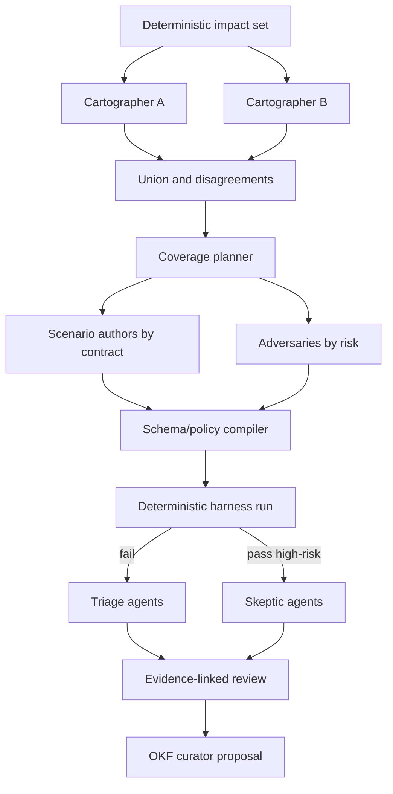

# Boundary

`tode-harness-agent` may read approved repository snapshots and redacted evidence, then emit schema-validated proposals. It cannot invoke product binaries, open network listeners, mutate fixtures/baselines/contracts, alter run policy, or write a verdict. Only `tode-harness` executes and judges scenarios.

DeepSeek V4 Flash can be configured as one provider/model route, but a task is considered DeepSeek-produced only when the recorded provider response and model identity prove it. A requested model name in a prompt is not provenance.

# Roles

| Role | Inputs | Output | Authority |
|---|---|---|---|
| Cartographer | changed files/symbol graph, catalog | impacted contracts, unmapped behavior, evidence paths | proposal; only broadens deterministic impact |
| Coverage planner | selected contracts, existing scenarios/history | coverage gaps, scenario plan, risk rationale | proposal |
| Scenario author | one contract/gap, schema, allowed vocabulary | scenario JSON object and fixture requests | proposal; compiler/policy must accept |
| Fixture mutator | reviewed fixture, mutation policy | bounded variants and expected relation | proposal |
| Adversary | contract, implementation evidence, scenarios | plausible bug/fault/mutation attacks | proposal |
| Visual auditor | screenshots, DOM/a11y/diffs | semantic observations, missing deterministic assertions | review; no pass override |
| Failure triager | failed assertions and evidence graph | clusters, likely causes, next diagnostics | diagnosis only |
| Skeptic | passing run, coverage graph, mutation results | missing evidence, weak normalizers, challenge scenarios | review gate for high risk |
| OKF curator | accepted verdicts/decisions and current concepts | patch proposal with sources/staleness changes | proposal; human/process applies |

No role combines scenario authorship, deterministic execution, and approval.

# Task Envelope

Every invocation receives a canonical envelope:

```json
{
  "task_id": "sha256:...",
  "run_id": "...",
  "role": "scenario-author-v1",
  "model": {
    "provider": "configured-provider-id",
    "requested": "deepseek-v4-flash",
    "reported": null,
    "endpoint_revision": null
  },
  "prompt_template": "sha256:...",
  "system_policy": "sha256:...",
  "inputs": [
    { "kind": "contract", "id": "C05", "digest": "sha256:..." },
    { "kind": "source-snapshot", "path": "src/ipc.ts", "digest": "sha256:..." }
  ],
  "output_schema": "agent/scenario-proposal-v1",
  "permissions": ["read:declared-inputs"],
  "budget": { "wall_ms": 60000, "input_bytes": 200000, "output_bytes": 50000 },
  "attempt": 1,
  "parent_tasks": [],
  "redaction_policy": "agent-redaction-v1"
}
```

The response record adds provider request/response IDs where available, reported model/version, timing, token/byte usage, finish reason, raw-response digest, parsed-output digest, validation result, and error classification.

Missing reported model identity prevents a model-specific requirement from passing.

# Planning DAG



Independent roles/tasks fan out. Barriers exist only where downstream work requires upstream artifacts. The deterministic planner records the union; agent disagreement is an artifact, not averaged away.

# Proposal Admission

An agent output is usable only when:

* JSON parses and matches the exact role schema;
* every cited path/symbol/artifact exists in declared inputs;
* every current-state claim has evidence;
* output uses only registered contracts/step/adapter/normalizer IDs;
* no forbidden instruction, executable content, external URL, secret, or unbounded fixture appears;
* scenario risk/capability/time budgets satisfy policy;
* duplicate proposal detection and content digest succeed.

Rejected proposals remain in evidence with reasons. The orchestrator never “repairs” malformed content silently; a bounded correction task may receive validation errors as a new attempt.

# Scenario Quality Gate

Before review, an agent-proposed scenario must:

1. compile without policy exceptions;
2. pass on the expected reference target or satisfy its expected-failure contract;
3. fail against at least one reviewed synthetic mutation/fault representing the claimed bug class, unless the scenario is pure characterization awaiting contract review;
4. add unique contract/surface/risk coverage rather than duplicate an existing scenario without justification;
5. run deterministically across repeated fresh sandboxes;
6. produce bounded evidence.

Agents do not get to label their own scenario valuable; deterministic mutation/coverage evidence establishes it.

# Consensus and Disagreement

Consensus is for prioritization/explanation, never truth. Policies may request independent agents/models for critical planning or visual review. Reconciliation preserves:

* agreed items;
* items supported by only one agent;
* direct conflicts;
* evidence each side cited;
* deterministic checks that can resolve the dispute;
* unresolved questions requiring human/contract decision.

Majority vote cannot override a contract failure. Identical outputs from the same cached model/prompt do not count as independent support.

# Budgets and Concurrency

Budgets are per task, role, run, provider, and cost class. The scheduler caps concurrent tasks, input/artifact size, wall time, correction attempts, and total generated scenarios. It prioritizes critical/high changed contracts, unmapped source, failed scenarios, then broader exploration.

Agents receive progressive disclosure: contract/index first, then exact source/evidence sections through bounded retrieval. They do not ingest the whole repository/run by default.

# Caching

Cache key covers the complete canonical task envelope, input digests, prompt/system policy, provider/model identity, output schema, redaction policy, and orchestrator version. A cache hit revalidates output under current policy. Changes to any input/policy invalidate it.

Caches never substitute for deterministic scenario execution. A cached scenario proposal can be reused; its resulting observations cannot.

# Retry and Failure

Retries only for provider transport/rate-limit/authentication errors classified before content acceptance. Model refusal, malformed output, unsupported model, or evidence fabrication can trigger at most a bounded correction/reassignment policy; every attempt remains visible.

A task requested for `deepseek-v4-flash` that fails in an upstream wrapper is recorded as `provider_preflight_failed`, not as DeepSeek failure or success.

# Provider Outage Policy

* Deterministic known suites always run.
* Optional discovery/triage outage produces `agent_stage_failed` warnings and no invented output.
* Required high-risk skeptic/visual review outage makes that gate inconclusive.
* Release certification policy decides which agent roles are required; it names alternatives and a human fallback explicitly.
* No automatic model substitution where a policy requires diversity or a named model. A substitution requires a new task envelope and remains distinguishable.

# Prompt-Injection Defense

Repository files, logs, web content, screenshots/OCR, and agent outputs are untrusted data. Task templates:

* label each input as data and delimit it structurally;
* never interpolate source text into system instructions;
* give no shell/network/write tools;
* expose only declared artifact reads;
* require schema output with evidence references;
* scan outputs for attempted instructions/secrets/executable payloads;
* use an independent adversarial reviewer for high-risk proposals.

The deterministic orchestrator ignores instructions found inside evidence.

# Human Gates

Human or separately authorized process approval is mandatory for:

* contract semantic changes;
* risk lowering;
* baseline acceptance;
* normalizer information loss increase;
* security policy exception;
* release certification exception;
* stable OKF status/verification updates;
* clean-cutover deletion approval.
