# Component Model

```mermaid
flowchart LR
  Change[Change detector] --> Catalog[OKF contract catalog]
  Catalog --> Impact[Deterministic impact graph]
  Change --> AgentPlan[Planning agents]
  AgentPlan --> Proposal[Scenario/risk proposals]
  Proposal --> Policy[Schema and policy gate]
  Impact --> Plan[Signed run plan]
  Policy --> Plan
  Plan --> Scheduler[Capability scheduler]
  Scheduler --> Worker[Isolated scenario worker]
  Worker --> Adapters[Surface adapters]
  Adapters --> Evidence[Content-addressed evidence store]
  Evidence --> Oracle[Deterministic oracle engine]
  Oracle --> Verdict[Verdict and reports]
  Evidence --> Triage[Triage/adversarial agents]
  Triage --> Review[Evidence-linked review proposals]
  Verdict --> Cert[CI/release certification]
  Review --> Cert
```



# Planes

## Deterministic Control Plane

Owns catalog compilation, change-impact selection, policy, scenario validation, run-plan construction, capability scheduling, budgets, state transitions, verdict aggregation, report generation, and certification. It is the only plane allowed to declare a gate passed.

## Isolated Execution Plane

Owns sandbox provisioning, target resolution, ports/sockets, local peers, PTYs, process groups, fault injection, surface adapters, observation capture, and teardown. Workers receive an immutable signed run-plan shard and cannot modify policy or baselines.

## Agent Plane

Owns semantic planning, scenario proposals, adversarial variants, visual/evidence review, failure clustering, and OKF change proposals. It consumes redacted repository/evidence views through provider adapters. It can add work to a plan only through schema and policy validation; it cannot directly execute targets or write approved artifacts.

## Evidence Plane

Stores immutable manifests, scenario snapshots, target/build identity, observations, oracle traces, agent task envelopes, agent outputs, logs, and reports by digest. Reports contain references, not copies whose provenance can diverge.

# Rust Workspace Additions

Two crates keep the trust boundary obvious:

| Crate | Responsibility | Dependency rule |
|---|---|---|
| `tode-harness` | Catalog compiler, scenario model/compiler, scheduler, sandbox, adapters, observations, normalizers, oracles, artifacts, reports, CLI | Must not depend on model SDKs or external agent services |
| `tode-harness-agent` | Provider-neutral task envelopes, model adapters, redaction, caching, proposal validation, role DAGs, review synthesis | Depends on public `tode-harness` models; deterministic core never depends back |

`xtask` invokes the harness for CI/release workflows but does not reimplement harness logic. Product crates expose test-only binaries or protocol endpoints rather than importing harness code.

# Proposed Repository Layout

```text
crates/
  tode-harness/
    src/{catalog,scenario,plan,scheduler,sandbox,adapter,observe,normalize,oracle,artifact,report}.rs
  tode-harness-agent/
    src/{provider,task,roles,redaction,cache,review}.rs
harness/
  schemas/                  # JSON Schemas and generated examples
  policies/                 # versioned gate, risk, capability, redaction policies
  scenarios/                # reviewed *.scenario.jsonc files
    cli/
    runtime/
    protocols/
    profile/
    shortcuts/
    web/
    release/
  fixtures/                 # immutable inputs, each referenced by digest
  baselines/                # reviewed expected bytes/images/trees
  target-manifests/         # legacy and Rust executable aliases/capabilities
  agent-prompts/            # versioned role prompt templates and output schemas
  mutations/                # reviewed mutation/fault campaign definitions
compat/                     # temporary legacy executable/fixtures until M8
```

Generated run artifacts live outside the repository by default under the configured artifact root, never inside `harness/baselines/`.

# CLI Contract

```text
tode-harness catalog check
tode-harness plan --base <git-ref> --head <git-ref> [--with-agents]
tode-harness run --plan <plan.json> [--shard N/M]
tode-harness replay <run-id> [--scenario <id>]
tode-harness explain <run-id> [--failure <id>]
tode-harness propose-baseline <run-id> <observation-id>
tode-harness approve-baseline <proposal> --reviewer <identity>
tode-harness certify-release --run <run-id> --manifest <manifest.json>
```

`approve-baseline` verifies an authorization policy and records the old/new digest, reviewer, contract, reason, and evidence. It never accepts an agent identity as reviewer.

# Run Planning

Inputs:

* base/head source identities and dirty-state digest;
* compiled OKF catalog digest;
* scenario/policy/fixture/baseline digests;
* target manifests and build identities;
* detected symbol/file changes;
* required platform capabilities;
* agent proposals that survived schema/policy review.

Outputs: an immutable `RunPlan` containing selected scenarios, reasons for selection, dependency DAG, resource locks, budgets, target pair, expected observations, policy version, and agent-review requirements.

# Change Impact

Selection combines deterministic and agentic sources:

1. direct contract/scenario mappings from the catalog;
2. source dependency graph impact from changed symbols/files;
3. persisted historical co-failure edges;
4. mandatory risk sentinels;
5. agent-proposed contracts/scenarios with evidence and rationale.

The union runs. An agent can broaden selection but cannot remove deterministic selections.

A changed production symbol with no contract mapping fails `catalog check` for high-risk paths and produces a required-review warning elsewhere.

# Capability Scheduler

Scenarios declare capabilities such as `os:macos`, `arch:arm64`, `terminal:ghostty`, `terminal:kitty`, `browser:chromium`, `network:loopback`, `network:isolated`, `pty`, `worker:r2-emulator`, or `hardware:graphics-protocol`.

Workers advertise attested capabilities. The scheduler:

* constructs a dependency DAG;
* assigns only compatible workers;
* holds named exclusive resources such as a terminal instance;
* shards independent nodes by historical duration;
* applies per-run/per-scenario time and byte budgets;
* records unschedulable scenarios as `inconclusive`, never pass;
* supports resumption from completed immutable nodes.

# Extension Model

Adapters, step kinds, observation kinds, normalizers, and oracles use compile-time registries with stable string IDs and schema versions. A scenario cannot name dynamically loaded code. Adding an extension requires Rust code, tests proving containment/determinism, schema documentation, and policy approval.

# Failure Taxonomy

* `contract_failure`: deterministic product mismatch.
* `scenario_invalid`: schema or compile failure.
* `sandbox_failure`: containment/provision/teardown failure.
* `infrastructure_error`: worker/service/tool unavailable before trustworthy observation.
* `inconclusive`: required capability/evidence/oracle unavailable or conflicting authority.
* `agent_stage_failed`: optional or required agent task failed; known deterministic results remain intact.
* `policy_failure`: missing mapping, unapproved baseline, stale contract, forbidden step, or provenance problem.

Only `passed` satisfies a required gate. Retries apply only to preclassified infrastructure errors.

# Core Dependency Candidates

Candidates include `serde`/`serde_json`, `schemars` plus a JSON Schema validator, the ported source-preserving JSONC parser, `tokio`, `nix`, `tempfile`, `camino`, `sha2`, `blake3` only if a separate internal digest is justified, `tracing`, `uuid` or digest-derived IDs, `similar`, `image`, and protocol-specific clients. Every dependency requires maintenance/license/MSRV/platform review before adoption.
