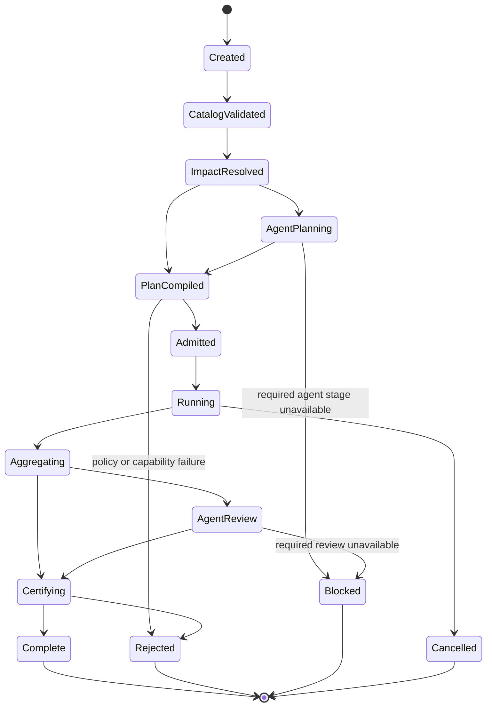

# Run Identity

A run has two identifiers:

* `run_key`: deterministic hash of source/build identities, catalog, plan policy, scenarios, fixtures, baselines, targets, platform capabilities, and required agent-task templates.
* `run_id`: `run_key` plus an invocation nonce, allowing multiple attempts without overwriting evidence.

A resumed run uses the same `run_id` and append-only event log. A new retry creates a new attempt under the same scenario node; it never replaces the failed attempt.

# Run Lifecycle

Every transition is an event containing prior/new state, actor (`process:*` or `human:*`; never an unqualified model), timestamp, input/output digests, and reason.

# Scenario Node Lifecycle

| State | Meaning |
|---|---|
| `selected` | Included with deterministic and/or agent selection reasons |
| `compiled` | Schema, registry IDs, paths, policy, and target capabilities validated |
| `queued` | Dependencies satisfied; waiting for a compatible worker/resource lock |
| `provisioning` | Sandbox, leases, fixtures, peers, and target clone being created |
| `executing` | Steps are running under budgets |
| `observing` | Requested evidence is being sealed |
| `comparing` | Normalizers and oracle rules are executing |
| `passed` | Every required assertion passed and teardown evidence is clean |
| `failed` | At least one trustworthy contract assertion failed |
| `inconclusive` | Trustworthy verdict impossible because required capability/evidence/authority is absent |
| `infrastructure_error` | Worker/service failed before trustworthy product comparison |
| `cancelled` | Explicit cancellation; never equivalent to pass |

`sandbox_failure`, `scenario_invalid`, and `policy_failure` are terminal classified failures, represented separately from product mismatch.

# Step Lifecycle

Each step is `pending -> ready -> running -> succeeded|failed|timed_out|cancelled`. Dependencies form a DAG. Independent local peer setup can run concurrently, but observable product steps retain declared order. A failed prerequisite prevents dependents and records them as `not_run_dependency`.

# Admission

Before any process starts, admission verifies:

* run-plan signature/digest and policy version;
* scenario compiler version and supported schema;
* target build and fixture/baseline digests;
* worker capability attestation;
* sandbox root is outside real HOME and repository unless policy names a read-only checkout;
* required disk/time/process/network budgets;
* exclusive resource lease availability;
* secret handles and redaction policy;
* required agent stages either succeeded or are explicitly optional.

Any containment ambiguity rejects admission.

# Scheduling and Sharding

The scheduler uses historical p50/p95 durations and resource requirements to balance shards. It does not use historical pass rates to skip work. Dependencies, platform constraints, exclusive terminal/browser resources, and release ordering are hard constraints.

A plan records selection reason per scenario:

* direct contract impact;
* source graph impact;
* fixture/adapter/policy change;
* critical sentinel;
* historical co-failure;
* agent proposal;
* explicit operator selection;
* full/release suite.

This makes under-selection reviewable.

# Retry Policy

Retries are permitted only for allowlisted infrastructure classes such as worker loss before observation, broken port lease, or transient artifact-store unavailability. Product exit, timeout defined by contract, output mismatch, crash, leak, visual mismatch, and assertion failure are not retryable.

Rules:

* maximum attempts is scenario/policy bounded;
* fresh sandbox and leases per attempt;
* exponential backoff only for external infrastructure;
* all attempts retained;
* a later successful infrastructure attempt may produce pass, but report surfaces earlier infrastructure errors;
* mixed product verdicts across identical attempts become `inconclusive/flaky`, not pass.

# Resumption

A coordinator crash can replay the append-only event log and verify sealed node artifacts. Nodes with complete, digest-valid evidence remain complete; running/provisioning nodes are abandoned, their worker leases expire, and they rerun in fresh sandboxes. The artifact store never trusts coordinator memory alone.

# Cancellation

Cancellation stops new scheduling, signals each process group, waits a bounded grace period, kills remaining descendants, captures partial logs/containment evidence, releases resources, and seals the run `cancelled`. Release publication steps use explicit transaction compensation before cancellation completes.

# Aggregation

Required-run verdict precedence:

1. policy/security/sandbox failure;
2. product contract failure;
3. inconclusive or required capability/agent review missing;
4. infrastructure error after retry exhaustion;
5. passed.

A single required failure prevents certification. Optional exploratory scenarios are reported separately and cannot dilute required results.

# Exit Codes

| Code | Meaning |
|---:|---|
| 0 | required run passed |
| 1 | product/contract assertion failed |
| 2 | invalid scenario/catalog/plan or policy failure |
| 3 | inconclusive or required capability/review unavailable |
| 4 | infrastructure/sandbox error after policy handling |
| 5 | cancelled |

Machine reports carry detailed enums; CLI exit codes remain stable and coarse.
